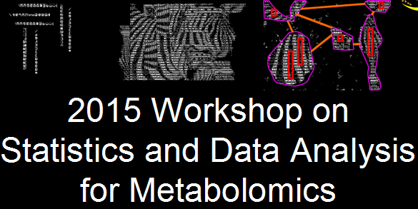

# 

## Instructions

### 1. Download the project and unzip to the desktop. 
### 2. Navigate to Goals/powerpoints/0-Introduction.ppt and follow along with the tutorial. 

### The workshop consists of 10 induvidual hands on lessons. Lessons 1 through 8 use [DeviumWeb](http://dgrapov.github.io/DeviumWeb/) and lessons 9 and 10, [MetaMapR](http://dgrapov.github.io/MetaMapR/). 

### Follow along with all the tutorials at  [createdatasol.com](http://createdatasol.com/).

